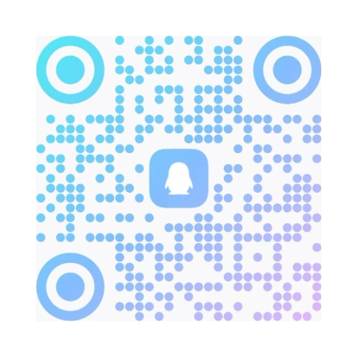

[English](README_EN.md) | 简体中文

# Antigravity 中文本地化词典

[](LICENSE)
[](dist/zh-cn-ui-dictionary.json)
[](dicts/)
[](https://antigravity.google)

本项目专为 Google Antigravity 智能体开发环境整理**纯净中文本地化词典数据集**。

---

## 1. 项目概述

为社区开发者与本地化爱好者提供高质量、经过防死循环清洗的母语词库资产：
1. **纯净数据资产**：标准键值对字典，开箱即用；
2. **多语言双模支持**：
   - 简体中文：收录 5,571 条全量核心词条；
   - 繁体中文：收录 5,075 条核心词条；
3. **数据纯净合规**：
   - 剔除翻译值包含键名自身的自递归条目，避免渲染死循环；
   - 完整保护动态占位符；
   - 剥离多余英文翻译对照括号。

---

## 2. 目录数据结构

```
Antigravity-Chinese-Dictionary/
├── assets/                      # 社区展示与交流群二维码资源
│   ├── qq_group_qrcode.png      # QQ 交流群二维码 (群号: 222403941)
│   └── wechat_group_qrcode.png  # 微信交流群二维码
├── dicts/                       # 简体中文分片词典 (纯 JSON, 5,571 词条)
│   ├── 01-common.json           # 通用基础词汇 (2,962 词条)
│   ├── 02-menu.json             # 顶栏与系统菜单 (392 词条)
│   ├── 03-chat-agent.json       # 智能体与对话会话 (905 词条)
│   ├── 04-settings.json         # 设置中心与配置 (428 词条)
│   ├── 05-mcp-tools.json        # MCP 与插件扩展 (328 词条)
│   ├── 06-workbench-ide.json    # 工作台与向导编辑器 (450 词条)
│   └── 07-notifications.json    # 通知与系统状态 (284 词条)
├── dicts_tw/                    # 繁体中文分片词典 (纯 JSON, 5,075 词条)
│   ├── 01-common.json           # 通用基础词汇 (2,606 词条)
│   ├── 02-menu.json             # 顶栏与系统菜单 (389 词条)
│   ├── 03-chat-agent.json       # 智能体与对话会话 (840 词条)
│   ├── 04-settings.json         # 设置中心与配置 (416 词条)
│   ├── 05-mcp-tools.json        # MCP 与插件扩展 (302 词条)
│   ├── 06-workbench-ide.json    # 工作台与向导编辑器 (425 词条)
│   └── 07-notifications.json    # 通知与系统状态 (275 词条)
├── dist/                        # 聚合单文件主字典 (开箱即用)
│   ├── zh-cn-ui-dictionary.json # 权威简体主字典 (5,571 词条)
│   └── zh-tw-ui-dictionary.json # 权威繁体主字典 (5,075 词条)
├── LICENSE                      # 开源许可证
├── README.md                    # 中文说明文档
└── README_EN.md                 # 英文说明文档
```

---

## 3. 使用方式

直接读取 `dist/` 目录下的聚合单文件 JSON 字典，或根据实际业务场景按需合并 `dicts/` 下的功能分片。

键值结构示例：
```json
{
  "New Window": "新建窗口",
  "Open Project": "打开项目",
  "Command Palette": "命令面板",
  "Connect to WSL": "连接到 WSL",
  "Default Distro": "默认发行版",
  "Download the Antigravity IDE": "下载 Antigravity IDE",
  "Attach Antigravity server logs": "附加 Antigravity 服务器日志"
}
```

---

## 4. Star 增长趋势

<a href="https://star-history.com/#markx520/Antigravity-Chinese-Dictionary&Date">
  
</a>

---

## 5. 社区交流群

欢迎加入社区交流群，探讨词条优化、提示词编写与本地化开发经验：

| QQ 交流群 | 微信交流群 |
| :---: | :---: |
|  |  |
| **群号：222403941** | **Antigravity Nexus 交流群** |
| 验证信息：`Antigravity` | 扫码直接加入（若群满请提 Issue） |

---

## 6. 贡献者

本项目由开源社区与以下贡献者共同维护：

| [<br /><sub><b>markx520</b></sub>](https://github.com/markx520)<br />[核心维护者 / Creator] |
| :---: |

欢迎更多开发者参与贡献！详见 [分片词典目录](dicts/)。

---

## 7. 免责声明与禁止倒卖

1. **研究目的**：本项目仅为文本数据集，供开发者进行软件本地化与词汇对齐参考；
2. **免责条款**：本项目按现状提供，使用者自行评估并承担使用风险；
3. **商标声明**：Google、Antigravity 标识为 Google LLC 的资产，本项目与 Google 无直接从属关系；
4. **禁止倒卖**：本项目基于 MIT 协议免费开源，严禁二次打包加价销售或商业牟利。
